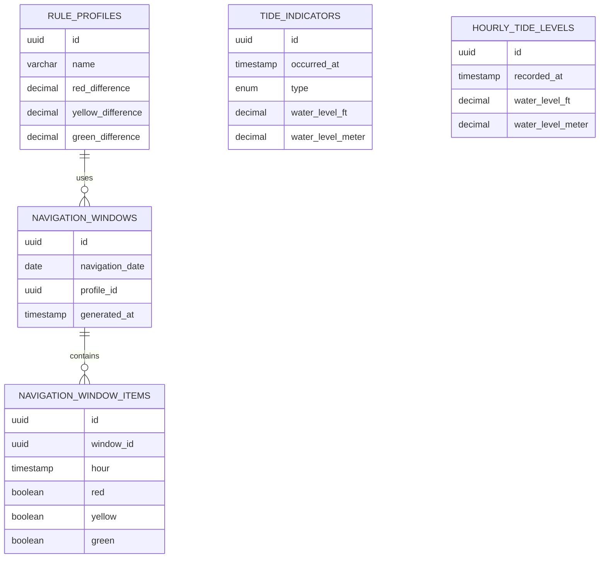

# TideNav

# Database Design Document

**Version:** 1.0  
**Author:** Ikhmal  

**Database:** PostgreSQL  
**ORM:** Prisma ORM  

---

# 1. Database Design Philosophy

The TideNav database is designed around the separation between:

1. Raw marine data.
2. Navigation rules.
3. Generated navigation decisions.

The database should store:

- Original tide information.
- Hourly observations.
- Generated navigation windows.

The database should NOT contain:

- Navigation calculations.
- Threshold formulas.
- Color assignment logic.

All calculation logic belongs inside the Navigation Engine.

---

# 2. Core Database Entities

The system contains five main tables.

```
rule_profiles

tide_indicators

hourly_tide_levels

navigation_windows

navigation_window_items
```

---

# 3. Entity Relationship Diagram



---

# 4. Table Overview

|Table|Purpose|
|-|-|
|rule_profiles|Stores navigation calculation configurations|
|tide_indicators|Stores HIGH and LOW tide events|
|hourly_tide_levels|Stores hourly tide readings|
|navigation_windows|Stores generated daily navigation output|
|navigation_window_items|Stores hourly navigation status|

---

# 5. rule_profiles

## Purpose

Stores configurable navigation rules.

Example:

```
Default Navigation Profile

Red Difference:
2.5 ft

Yellow Difference:
1.5 ft

Green Difference:
2.5 ft

Yellow Disabled:
07:00 - 19:00
```

---

## Schema

|Column|Type|Description|
|-|-|-|
|id|UUID|Primary key|
|name|VARCHAR|Profile name|
|red_difference|DECIMAL|Red threshold difference|
|yellow_difference|DECIMAL|Yellow threshold difference|
|green_difference|DECIMAL|Green threshold difference|
|yellow_disabled_start|TIME|Yellow restriction start|
|yellow_disabled_end|TIME|Yellow restriction end|
|active|BOOLEAN|Enable profile|
|created_at|TIMESTAMP|Created time|
|updated_at|TIMESTAMP|Updated time|

---

# 6. tide_indicators

## Purpose

Stores important tidal events.

Examples:

- HIGH tide
- LOW tide

---

## Example Data

|Occurred At|Type|Level|
|-|-|-|
|2026-07-01 01:47|HIGH|7.22|
|2026-07-01 07:53|LOW|3.61|
|2026-07-01 13:45|HIGH|8.86|

---

## Schema

|Column|Type|
|-|-|
|id|UUID|
|occurred_at|TIMESTAMP|
|type|ENUM|
|water_level_ft|DECIMAL|
|water_level_meter|DECIMAL|
|source|ENUM|
|created_at|TIMESTAMP|
|updated_at|TIMESTAMP|

---

# 7. hourly_tide_levels

## Purpose

Stores hourly tide measurements.

---

## Example Data

|Recorded At|Level|
|-|-|
|2026-07-01 01:00|7.20|
|2026-07-01 02:00|7.10|
|2026-07-01 03:00|6.80|

---

## Schema

|Column|Type|
|-|-|
|id|UUID|
|recorded_at|TIMESTAMP|
|water_level_ft|DECIMAL|
|water_level_meter|DECIMAL|
|source|ENUM|
|created_at|TIMESTAMP|
|updated_at|TIMESTAMP|

---

## Constraint

Only one hourly reading per timestamp.

Example:

Allowed:

```
2026-07-01 01:00
```

Not allowed duplicate:

```
2026-07-01 01:00
2026-07-01 01:00
```

---

# 8. navigation_windows

## Purpose

Stores generated navigation output.

A navigation window represents one generated day.

Example:

```
Date:

2026-07-01


Profile:

Default


Generated:

08:30
```

---

## Schema

|Column|Type|
|-|-|
|id|UUID|
|navigation_date|DATE|
|profile_id|UUID|
|generated_at|TIMESTAMP|
|status|ENUM|
|created_at|TIMESTAMP|

---

# 9. navigation_window_items

## Purpose

Stores hourly navigation results.

One record represents one hour.

---

## Example

|Hour|Red|Yellow|Green|
|-|-|-|-|
|01:00|TRUE|FALSE|FALSE|
|02:00|TRUE|FALSE|FALSE|
|03:00|FALSE|TRUE|FALSE|
|04:00|FALSE|FALSE|TRUE|

---

## Schema

|Column|Type|
|-|-|
|id|UUID|
|window_id|UUID|
|hour|TIMESTAMP|
|water_level_ft|DECIMAL|
|water_level_meter|DECIMAL|
|is_red|BOOLEAN|
|is_yellow|BOOLEAN|
|is_green|BOOLEAN|
|remarks|TEXT|

---

# 10. Enum Design

## Tide Indicator Type

```sql
HIGH

LOW
```

---

## Data Source

```sql
EXCEL

MANUAL

API

OCR
```

---

## Navigation Status

```sql
GENERATED

FAILED
```

---

# 11. Prisma Schema

```prisma

model RuleProfile {

  id String @id @default(uuid())

  name String


  redDifference Decimal

  yellowDifference Decimal

  greenDifference Decimal


  yellowDisabledStart DateTime

  yellowDisabledEnd DateTime


  active Boolean @default(true)


  createdAt DateTime @default(now())

  updatedAt DateTime @updatedAt


  navigationWindows NavigationWindow[]

}


model TideIndicator {


  id String @id @default(uuid())


  occurredAt DateTime


  type TideType


  waterLevelFt Decimal

  waterLevelMeter Decimal


  source DataSource


  createdAt DateTime @default(now())

  updatedAt DateTime @updatedAt

}


model HourlyTideLevel {


  id String @id @default(uuid())


  recordedAt DateTime @unique


  waterLevelFt Decimal

  waterLevelMeter Decimal


  source DataSource


  createdAt DateTime @default(now())

  updatedAt DateTime @updatedAt

}


model NavigationWindow {


  id String @id @default(uuid())


  navigationDate DateTime


  profileId String


  profile RuleProfile
    @relation(
      fields:[profileId],
      references:[id]
    )


  status NavigationStatus


  generatedAt DateTime @default(now())


  createdAt DateTime @default(now())


  items NavigationWindowItem[]

}


model NavigationWindowItem {


  id String @id @default(uuid())


  windowId String


  window NavigationWindow
    @relation(
      fields:[windowId],
      references:[id]
    )


  hour DateTime


  waterLevelFt Decimal

  waterLevelMeter Decimal


  isRed Boolean @default(false)

  isYellow Boolean @default(false)

  isGreen Boolean @default(false)


  remarks String?

}


enum TideType {

 HIGH

 LOW

}


enum DataSource {

 EXCEL

 MANUAL

 API

 OCR

}


enum NavigationStatus {

 GENERATED

 FAILED

}

```

---

# 12. Database Index Strategy

## tide_indicators

Index:

```
occurred_at
```

Reason:

Most queries:

```
Get tide indicators by date
```

---

## hourly_tide_levels

Index:

```
recorded_at
```

Reason:

Timeline generation requires chronological sorting.

---

## navigation_windows

Index:

```
navigation_date
```

Reason:

Dashboard loads today's navigation window.

---

## navigation_window_items

Index:

```
window_id
```

Reason:

Retrieve hourly timeline.

---

# 13. Data Processing Flow

```text

Excel Import

↓

Parser

↓

tide_indicators

hourly_tide_levels

↓

Navigation Engine

↓

navigation_windows

↓

navigation_window_items

↓

Dashboard


```

---

# 14. Migration Strategy

Initial migration:

```
Create Rule Profiles

Create Tide Indicators

Create Hourly Tide Levels

Create Navigation Windows

Create Navigation Window Items
```

---

# 15. Seed Data

Initial Rule Profile:

```json
{
"name":"Default",

"redDifference":2.5,

"yellowDifference":1.5,

"greenDifference":2.5,

"yellowDisabledStart":"07:00",

"yellowDisabledEnd":"19:00"
}
```

---

# 16. Database Rules

## Rule 1

Never delete historical navigation windows.

---

## Rule 2

Raw tide data should remain unchanged after import.

---

## Rule 3

Navigation windows can be regenerated when rules change.

---

## Rule 4

Calculation logic must never exist inside SQL.

---

# 17. Future Expansion

Possible future tables:

```
locations

ports

users

roles

vessels

weather_conditions

api_sync_logs
```

These are intentionally excluded from Version 1.

---

# 18. Final Database Principle

The database stores:

```
What happened

+

What was generated
```

The Navigation Engine decides:

```
What should happen
```

This separation keeps TideNav flexible and maintainable.
